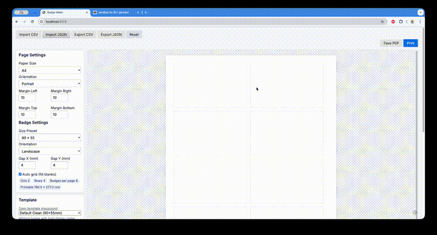

<p align="center">
  
</p>
<h1 align="center">Badge Maker</h1>
<p align="center">Print-first badge builder with CSV/JSON import, Mustache templates, and precise mm layout.</p>
<p align="center">
  <a href="https://vitejs.dev/"></a>
  <a href="https://purecss.io/"></a>
  <a href="https://github.com/janl/mustache.js/"></a>
  <a href="LICENSE"></a>
</p>

<p align="center">
  
</p>

## Table of contents
- [Features](#features)
- [Quick start](#quick-start)
- [Data formats](#data-formats)
- [Templates](#templates)
- [Template sandbox](#template-sandbox)
- [Roadmap](#roadmap)
- [Contributing](#contributing)
- [License](#license)

## Features
- Print-first layout in mm with A4, Letter, or Custom page sizes
- CSV/JSON import with column normalization and schema validation
- Mustache templates with theme CSS
- Inline participant editing and badge preview
- PDF export and print support
- Local storage persistence

## Quick start
```bash
npm install
npm run dev
```
Open the app, import CSV/JSON, choose template, and print or export PDF.

## Data formats

### CSV
Supported headers (any subset). Unknown columns are ignored unless mapped in `src/core/normalize.js`.

Canonical fields:
- Required: `id` (uuid or number), `firstName`, `lastName`
- Recommended: `displayName`, `role`, `company`, `title`, `country`, `city`, `email`, `phone`, `qrValue`, `badgeType`, `note`
- Event/branding (global or per-person override): `eventName`, `eventDate`, `eventLocation`, `eventLogo`, `sponsorLogo`

Example CSV:
```csv
id,firstName,lastName,displayName,role,company,title,email,qrValue
P-0001,Nikolay,Semenov,Nikolay Semenov,Speaker,Bpacks Lab,Materials Scientist,nikolay@example.com,https://example.com/checkin/P-0001
```

### JSON
Two supported shapes:
1) Array of participants
2) Object with `participants` and optional `meta`

Example (array):
```json
[
  {
    "id": "P-0001",
    "firstName": "Nikolay",
    "lastName": "Semenov",
    "displayName": "Nikolay Semenov",
    "role": "Speaker",
    "company": "Bpacks Lab",
    "title": "Materials Scientist",
    "email": "nikolay@example.com",
    "qrValue": "https://example.com/checkin/P-0001"
  }
]
```

Example (with meta):
```json
{
  "meta": {
    "eventName": "BadgeCon 2025",
    "eventDate": "2025-04-18",
    "eventLocation": "Berlin, Germany",
    "eventLogo": "https://dummyimage.com/120x40/0b75f5/ffffff&text=BadgeCon",
    "sponsorLogo": [
      "https://dummyimage.com/80x30/f97316/ffffff&text=Acme",
      "https://dummyimage.com/80x30/14b8a6/ffffff&text=Beta"
    ]
  },
  "participants": [
    {
      "id": "P-0001",
      "firstName": "Nikolay",
      "lastName": "Semenov",
      "displayName": "Nikolay Semenov",
      "role": "Speaker"
    }
  ]
}
```

Notes:
- `displayName` is optional; if missing it falls back to `firstName + lastName`.
- `sponsorLogo` can be a string or an array of strings.
- Any per-person `event*` fields override the global `meta` values.

## Templates
Templates live in `src/templates/<templateId>/` and are auto-discovered.
Each folder contains:
- `template.json` (name, description, size)
- `badge.mustache`
- `theme.css`

Use Mustache tags like `{{fieldName}}` and section helpers for optional fields:
```mustache
{{#role}}<div class="chip">{{role}}</div>{{/role}}
```

### Sponsor logos array
The field `sponsorLogo` accepts either a single string or an array of strings.
In the UI form, comma-separated URLs are split into an array.

```mustache
{{#sponsorLogo}}
  
{{/sponsorLogo}}
```

## Template sandbox
CodePen sandbox for quick experiments:
- https://codepen.io/ksider/pen/bNeEyPr

## Roadmap
- Template packs gallery with thumbnails
- Per-template editor fields configuration
- Batch QR export and SVG QR option
- Layout presets per paper vendor

## Contributing
Issues and PRs are welcome. Keep changes focused and include a short description.

## License
MIT. See `LICENSE`.
